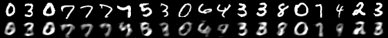

# Experiment 0 / Setup

An autoencoder setup was adapted from the Julia model zoo. [Code](../autoencoder.jl)

## How many hidden values?

64 hiddens, 0.007 error:

32 hiddens, 0.013 error:

16 hiddens, 0.022 error:

8 hiddens, 0.034 error:

4 hiddens, 0.047 error:

2 hiddens, 0.056 error:

... which makes 32 seem reasonable?
